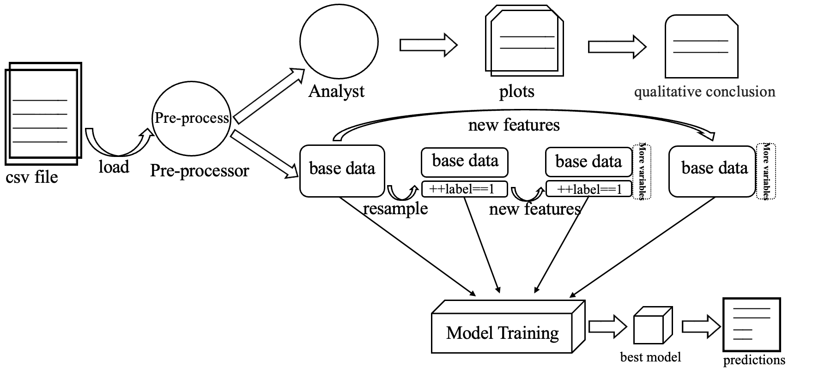
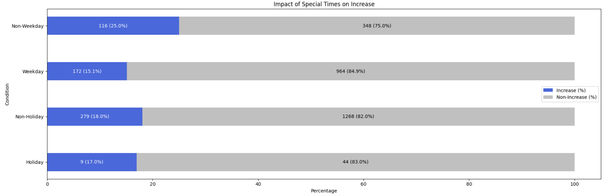
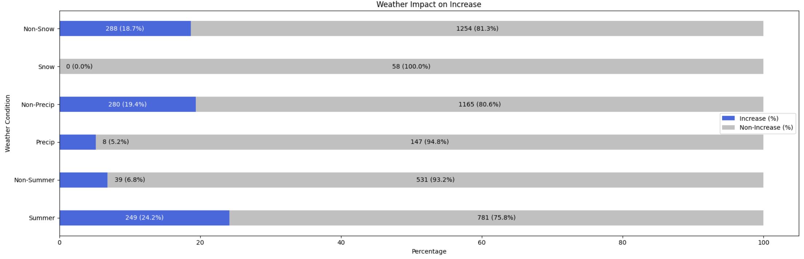
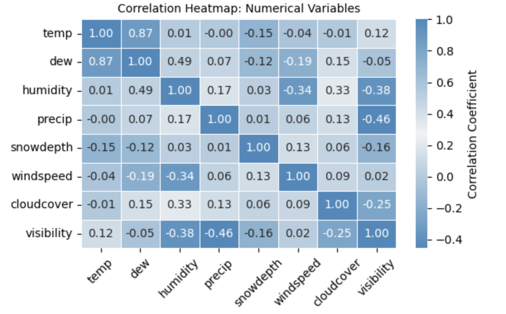
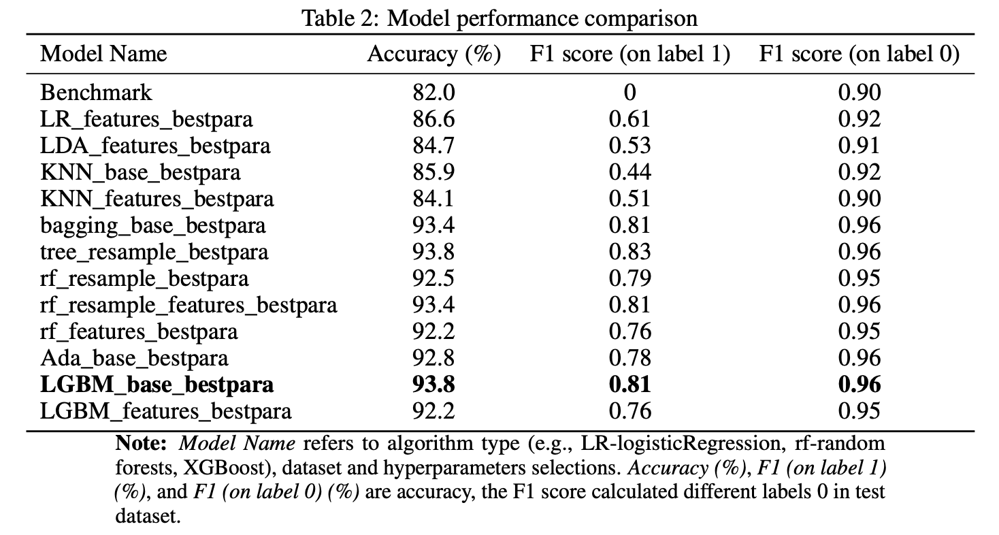

# SharingBikeAvailabilityClassifier
A binary classification model to predict whether the District Department of Transportation in Washington D.C. should increase the number of shared bikes at a given hour, based on date, time, weather, temperature, and other relevant features.

## 🚲 Bike Availability Classifier for Washington D.C.

This project builds a binary classification model to predict whether the District Department of Transportation (DDOT) should increase the number of public bikes at a given hour.  
The prediction is based on a variety of features including （but not limited) :

- Date and time
- Weather conditions
- Temperature and humidity
- Wind speed and seasonality

The model helps optimize bike availability decisions and improve user satisfaction in D.C.'s public bike-sharing system.

---

## 🛠️ What This Project Does

✔️ Loads and processes bike-sharing data  
✔️ Engineers relevant time- and weather-based features （ablation experiment on features） 
✔️ Trains a binary classifier to predict bike supply increase need  
✔️ Evaluates the model performance with classification metrics  
✔️ Visualizes key patterns and results

---

## 🔄 Pipeline Overview

The diagram below summarizes the full ML pipeline:

  
*Figure: End-to-end data pipeline from loading to prediction*

---

## 📊 Visual Examples

Here are some visualizations used in the project:

### 1. Data Distribution by Datetype and weathers



### 2. Correlation Heatmap  


### 3. Model Evaluation (Confusion Matrix or ROC)  


---

## 📁 Files

- `SharingBikeAvailabilty.ipynb` – Main notebook for training and evaluation
- `images/` – Folder to store pipeline diagrams and visualizations

---

## 🚀 How to Run

```bash
# Recommended setup
pip install -r requirements.txt
jupyter notebook SharingBikeAvailabilty.ipynb
